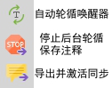
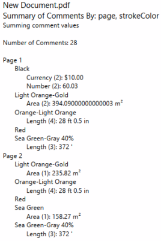
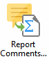
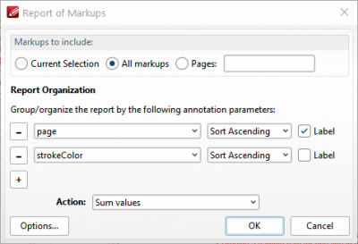
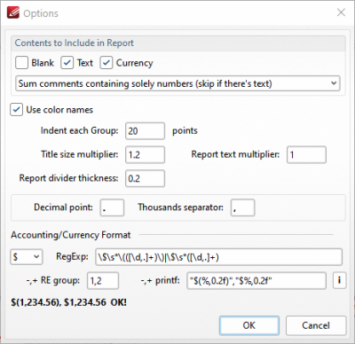
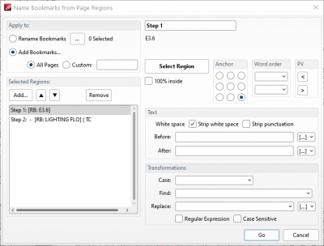
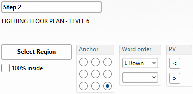

这是我的pdf xchange脚本插件库，虽然是脚本，但是可以插入按钮、界面等，和插件功能很像了，这是pdf xchange强大之处。
# 1. 环境要求
- PDF-XChange Editor 10.3+
- JavaScript 支持

使用方式就是将相关js文件放入PDF-Xchange Editor 的脚本文件夹，即PDFedit.exe下的JavaScripts文件夹下，没有这个文件夹就创建出来。

# Version3设置笔记文件夹自动导入导出（无导入时注释要手动导出才能激活自动同步）
插件文件：3ExportImportFunction.js、Version3设置笔记文件夹自动导入导出（无导入时注释要手动导出才能激活自动同步）.js

插件会在你打开PDF时，自动检查你指定的笔记文件夹里是否有对应的、非空的XFDF文件。如果有，就自动导入并激活监控。如果没有，或者文件是空的，就等待你手动操作来激活，当你在PDF上做了注释并使用插件提供的按钮导出，就会激活监控，之后只要注释有变化，就会自动导出xfdf。

包括以下3个新按钮：


## 快捷键
- `Alt+W`：导出并激活同步
- `Ctrl+S`：智能导出注释（工具栏按钮）其实重复了

## 文件结构
```
插件文件夹/
├── 3ExportImportFunction.js          # 核心函数库
└── Version3设置笔记文件夹自动导入导出.js  # 主同步脚本
```

# 对当前选中的第1个注释生成ob链接
文件：对当前选中的第1个注释生成ob链接.js

在你PDF-XChange Editor里选中一个注释，然后一键生成一个特殊的链接。你把这个链接粘贴到Obsidian里，点击后就能直接打开PDF，并精准跳转到那个注释所在的位置。

## 使用方法：
注册pxce外链，外链功能是较新版本的xchange才支持的，10.3以上，如果是安装包安装，会自动注册，如果是绿色包，就要手动导入注册表：
创建register_pxce_protocol.reg，把代码贴进去，双击运行。
```reg
Windows Registry Editor Version 5.00

[HKEY_CLASSES_ROOT\pxce]
@="URL:pxce Protocol"
"URL Protocol"=""

[HKEY_CLASSES_ROOT\pxce\shell]

[HKEY_CLASSES_ROOT\pxce\shell\open]

[HKEY_CLASSES_ROOT\pxce\shell\open\command]
@="\"D:\\Program Files\\Tracker Software\\PDF Editor\\PDFXEdit.exe\" \"%1\""

```

选中注释后，你有两种方式触发插件：
- 点击工具栏上的 “为选中的注释生成ObLink” 按钮。
- 或者使用快捷键 Alt+G。

# annotReport v1.2.1
文件：
2xutil.colorUtils.js
annotReport.js

[viewtopic.php?t=46293](https://forum.pdf-xchange.com/viewtopic.php?t=46293)
工具将生成 PDF 中标记的简单文本摘要，作为 PDF 文本报告，按任何标记参数进行摘要。它可以输出标记的文本（内容属性），或者计算标记（对于尺寸、周长和面积工具，或者如果它识别数字或货币，则合计 - Σ - 总计）。

该工具受论坛帖子 [viewtopic.php?t=45812](https://forum.pdf-xchange.com/viewtopic.php?t=45812) 和 [viewtopic.php?t=27327](https://forum.pdf-xchange.com/viewtopic.php?t=27327) 启发  
  
**使用方法 ，在注释页面**
  
如果你只想总结选定的标注，首先选择标注，然后运行该工具（评论 > 报告评论...）


它会打开一个对话框：

**要包含的批注**  

选择是否使用所有标注，或者只输入页面以获取标注。如果工具启动时已选择标注，你可以将工具应用于当前选择。  
**报告组织**
-  您可以添加或删除摘要级别。在上面的图片中，摘要将首先按页码排序，然后按批注的 strokeColor 排序。属性值可以按升序或降序排序，"标签"表示是否输出属性标签。
**操作**
-  **求和**将计算区域、长度、数字、货币或连接文本。  
- **计数**将仅计算找到的区域、长度、数字、货币或文本注释的数量。  
- **输出值**将列出每个标注值。


  
**选项** 选项...按钮会打开一个单独的对话框，用于更改报告的设置：
-   **报告包含内容** ：它可以跳过报告中的空白、纯文本或货币值
- 如果数字夹杂在文本中，它可以找到这些数字并将它们相加；或者可以将其视为文本。
- **使用颜色名称** ：如果勾选，它会尝试获取颜色的纯文本描述（例如"橙色"）。否则，它会以十六进制（网络）格式输出颜色。
- 您还可以调整摘要每个级别的缩进量以及相对文本大小。我认为这是11磅文本的倍数。
- 报告分隔线粗细是使用"输出值"时分隔文本注释的线条粗细。  
- **十进制和千位分隔符** ：如果您的区域设置使用不同的分隔符，请在此处更改。脚本需要将尺寸文本更改为数字，因此如果这些不正确，它将不知道 1.000 等于 1000 而不是 1，例如。 
- **会计/货币格式** ：在左上角的下拉列表中有一些预定义的会计和货币格式；或者更改正则表达式、RE 组和 prinf 选项：
    
    - _正则表达式_是一个包含货币数值部分的正则表达式，它通过捕获组设置，格式为（负数）|（正数）。
    - _\-,+ RE group_ 是正则表达式中的负向、正向捕获组
    - _\-,+ printf_ 是报告输出结果的格式化字符串。它被设置为"负向格式化字符串"、"正向格式化字符串"，并使用 util.printf 来格式化数字（如果点击右侧的按钮，弹出提示中会提供参数信息）。
    
最简单的方法是选择一个预定义的格式，然后修改正则表达式和格式字符串以供您使用（例如，用于不同的货币等）。

# bkmNameRegions v1.5
文件：
1ang.js
bkmNameReg.js
translationData.bkmNameReg.json

此工具会根据每页特定位置的文本命名书签。我制作它的目的是用于处理技术图纸，这些图纸在固定位置（例如在标题栏）包含图号和名称。 我认为类似这样的内置功能将是 PXE 的绝佳补充。我参考了“从页面文本生成书签”工具进行了设计——包括复制图标。

**使用方法，在书签页面**



**选择是否重命名当前书签或添加书签**  
在顶部，选择是否重命名当前书签或为页面范围添加书签。  
页面范围格式与打印对话框相同：短横线表示包含范围（10-20），逗号分隔范围（1,5,10-12）。  

对于 PDF XChange 版本 393 或更高版本，您可以使用 … 按钮选择要更改哪些书签。  
  
**页面标签** 该工具还可以将页面标签设置为与书签使用的文本匹配。在 PDF XChange 版本高于构建版本 398（v10.7）之后，它不会在标签前添加数字后缀——在那之前，javascript 只能以数字后缀的形式设置页面标签。  
  
**添加重命名步骤**  
在左上角，有按钮用于添加、移动或删除单个命名步骤。对于 PDF XChange 版本低于 387 的版本，还有一个“编辑”按钮。下方列出了这些步骤。每个“步骤”可以是一个单独的选定区域或文本片段，这些被组合起来形成新的书签名称。  
  
**编辑重命名步骤**  
从列表中选择一个步骤（ _对于版本低于 387 的版本_ ），然后按“编辑…”。 因为_版本低于 387 的 PDF XChange_ 不允许脚本知道何时选中了步骤，你必须按编辑按钮来更新右侧的表单。）  

在对话框的右侧是此步骤的选项。


从顶部开始：

-   顶部是此步骤的可编辑名称。
-  在那之下是当前页面选定区域中找到的文本的预览。
-  在那之下是一个 **Select Region 按钮：点击此按钮以选择页面上的区域。它应该会激活矩形工具，让你绘制一个矩形，绘制后不久，它会回到此对话框，并在 PDF 中以绿色显示矩形。**  
- **100% inside**：这是一个选项，用于选择是否仅包含完全位于选定区域内的文本，或允许单词稍微悬挂在矩形之外。
- **Anchor**：选定的区域可以锚定到页面角落、边缘中点或中心。这样，如果页面尺寸略有变化，选定的区域仍然能以相对于锚点的相同相对位置捕获文本。  
- **词序** ：由于标题块中的词语排列有时与 pdf 中存储的词序不匹配，因此有一个选项可以按页面的上下或左右顺序排序词序。  
- **预览** ：要预览不同页面上的选定文本，使用 < 或 \> 按钮来循环浏览当前选定的书签或页面范围。 
- **文本** ：可以选择是否从找到的文本中删除空白（空格、制表符、换行符等）或空白和标点符号；可以添加文本到页面找到的文本之前或之后。我包含了一些 PXE 宏的实现（序列号、页码、页数、页标签、文件名、日期，我还添加了一个添加前一个书签名的宏）。
-  **转换** : 案例可以更改为 UPPER、lower、Initial Capitals、Title Case。Title Case 会将所有单词首字母大写，除了 _a、an、the、for、and、nor、but、or、yet、so、as、at、by、for、in、of、on、per、pro、sub、thru、to、up、re、ca.、vs.、v.、w/、w/o_。它会对新名称进行查找替换，并且可以在替换文本中使用宏。


# isolateAnnots 隐藏/显示注释的工具
文件：annotReport.js

我在使用红色编辑工具时遇到了问题，它删除了我想要保留的注释（评论和印章），所以制作了这个工具来暂时隐藏页面上的注释。我发现，如果页面上有大量评论，而我想暂时让一些评论移开，这个工具也非常有用。

**在附加工具里**。

# mergeAnnots合并文档间的注释
文件：mergeAnnots_zh.js

[viewtopic.php?p=195026&hilit=mergeAnnots#p195026](https://forum.pdf-xchange.com/viewtopic.php?p=195026&hilit=mergeAnnots#p195026)
该工具尝试在不覆盖较新修改的情况下，合并多个 PDF 文档中的所有评论，并检测冲突（即同时编辑的评论）。它目前还略显粗糙，因此我不建议依赖它——如果有人有时间测试它并反馈问题，我将非常感谢。

背景
如果有多个人向 PDF 文档添加评论，他们要么需要共享同一个文档（但这样当一个人编辑时文档会被锁定），要么需要有一种方法来合并多个文档中的评论。其他 PDF 软件设置了基于订阅的在线编辑功能来处理这个问题，但那样你需要将你的文档托付给他们的服务器，这是一个专有解决方案。一种简单的蛮力方法是从所有文档中导出 FDF，然后将它们全部导入到你想要合并的文档中。但那样会覆盖第二个文档中任何已更改的内容，并且无法处理已删除的评论。

**共享面板下面**，点击工具打开一个详细的对话框。

# utilities for scripting xutils 工具函数
[viewtopic.php?p=195858&hilit=xutils#p195858](https://forum.pdf-xchange.com/viewtopic.php?p=195858&hilit=xutils#p195858)
xutils 工具函数（xutil.setInterval, xutil.setTimeout, xutil.clearInterval, xutil.clearTimeout, xutil.getNewAnn, xutil.PXEmacro, xutil.addBookmark, xutil.ClrUtx）

# find replace annot tx v1.2.1
find replace annot tx v1.2.1.js
查找替换注释里面的文本

# scrollsync.js
两个文档同步滚动

# viewNavigator.js
视图导航器，会自动记录前面近期的缩放、跳转，用它提供的按钮能快速跳回去。


